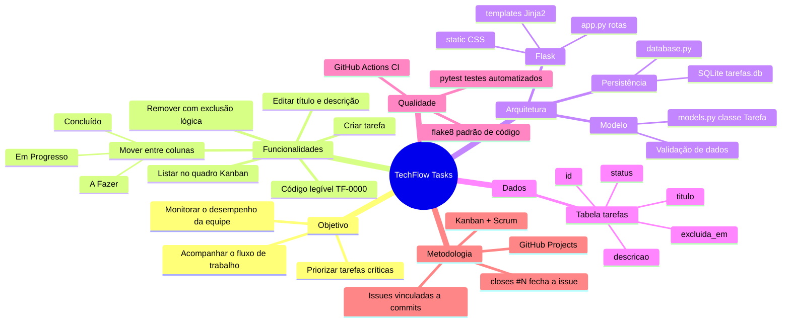

# Mapa mental do sistema

Visão geral do TechFlow Tasks em um único diagrama.

```mermaid
mindmap
  root((TechFlow Tasks))
    Objetivo
      Acompanhar o fluxo de trabalho
      Priorizar tarefas críticas
      Monitorar o desempenho da equipe
    Funcionalidades
      Criar tarefa
      Listar no quadro Kanban
      Editar título e descrição
      Mover entre colunas
        A Fazer
        Em Progresso
        Concluído
      Remover com exclusão lógica
      Código legível TF-0000
    Arquitetura
      Flask
        app.py rotas
        templates Jinja2
        static CSS
      Modelo
        models.py classe Tarefa
        Validação de dados
      Persistência
        database.py
        SQLite tarefas.db
    Dados
      Tabela tarefas
        id
        titulo
        descricao
        status
        excluida_em
    Qualidade
      pytest testes automatizados
      flake8 padrão de código
      GitHub Actions CI
    Metodologia
      Kanban + Scrum
      GitHub Projects
      Issues vinculadas a commits
      closes #N fecha a issue
```
